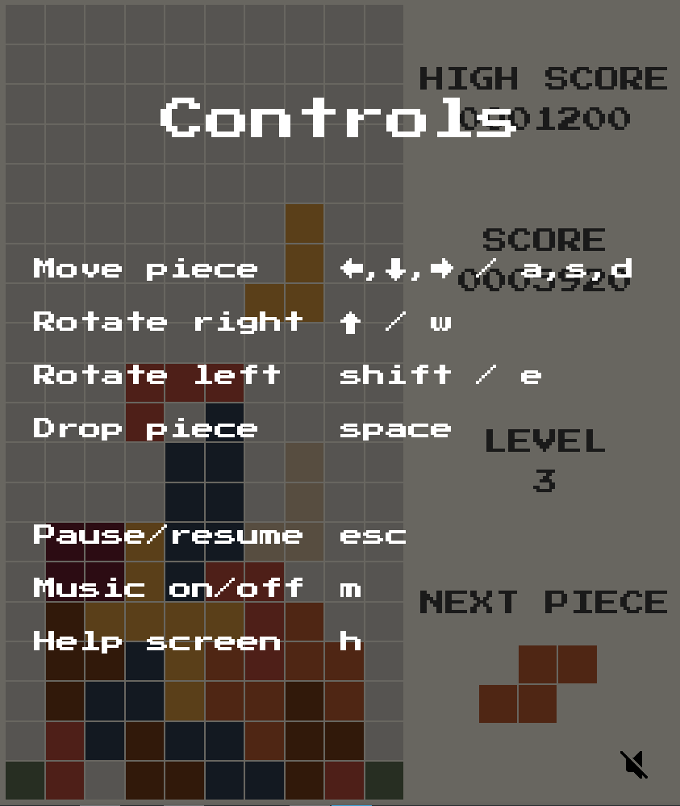

# Tetris

<h3>Laget som Semesteroppgave 1 i INF101 (objektorientert programmering) ved UiB</h3>

For å kunne kjøre programmet må Java 17 eller senere være installert, følg <a href="https://adoptium.net/">denne lenken</a> og installer <i>Latest LTS Release</i>
 

Spillet kan startes fra .jar filen, eller kompileres selv med Maven.

 
 

Laget av Florian ten Napel, koden sist oppdatert 15/3 - 2023
